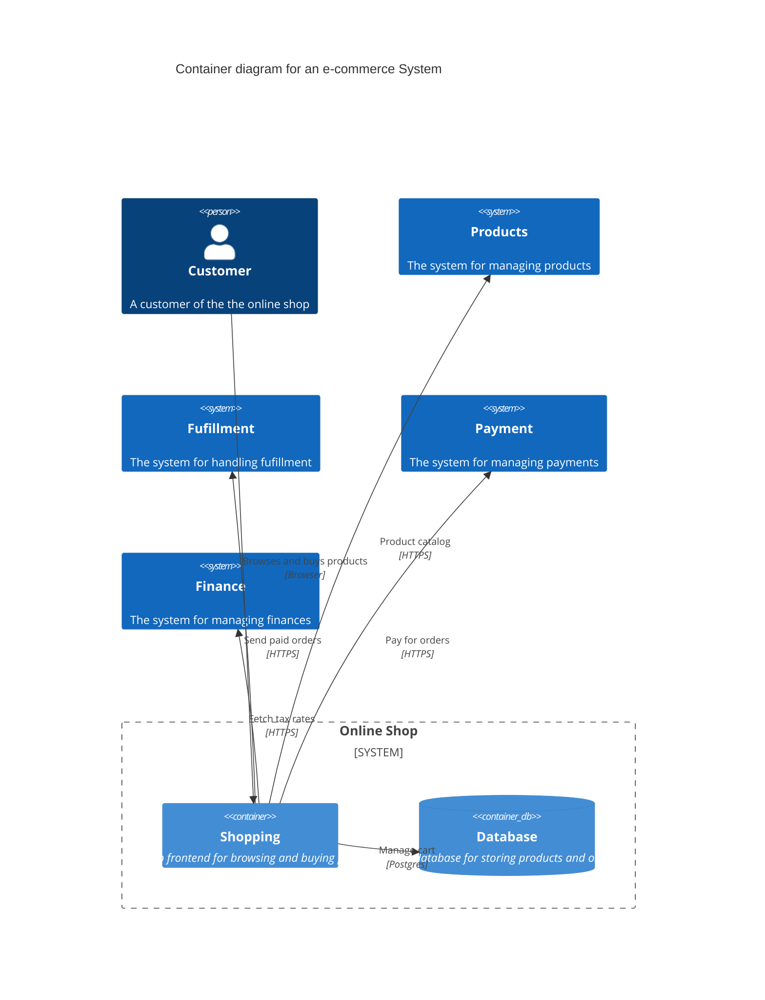

# Maintenance

This section is a kata that is aimed at highlighting practicing maintenance of a system. The kata is based on a simple e-commerce system that has a cart feature. The cart feature has been identified as a good candidate for some maintenance work. The kata is broken down into steps that will guide you through the process of making changes to the cart feature. The goal is to make the cart feature more maintainable and to increase the amount of behavior that is covered by unit tests.

> Note: The code in this repository is example code and should not be used as a reference of production as is.

Below it the C4 Context diagram showing the pieces of the system that are relevant to this kata.

## Context

We have an existing cart implementation which handles adding and removing items, as well as total calculations. After the initial implementaion, the team has listed some improvements that they would like to make.

1. More unit tests as currently there is only end-to-end tests.
2. A clean architecture to make the cart more testable.

## Instructions

Follow the kata, step by step. Do not read ahead. You are free to do any refactoring that you see fit as you go but try to keep them small. In fact, that is the goal of the kata, to make small changes that will make the code more maintainable, while still adding new features.

Pay close attention to what breaks as you make changes. A common problem is that the tests are too tightly coupled to the implementation and break when the implementation changes.

## Kata

## Step 1

The calculation of the total amount has been identified as a good first piece of behaviour to cover with unit tests, since some changes are coming to the calculation logic in the near future.

## Step 2

The company is starting to offer coupon codes to customers. Each coupon code has a discount percentage, a minimum amount that the cart must reach to be valid, an expiration date, and categories that the coupon is valid for. The cart should be able to apply a coupon code to only products that it is valid for. Remember that the team wants to increase the amount of behavior that is covered by unit tests.

## Step 3

A but has been reported where the same item can end up in the cart multiple times. The team discussed that this would be a good opportunity to write a test to confirm the bug and then fix it.

## Step 4

The company is starting to sell to B2B customers. B2B customers have a VAT tax rate of 20% added to their orders. The tax rate should be fetched from the finance system. Remember the teams desire to increase the amount of behavior that is covered by unit tests.