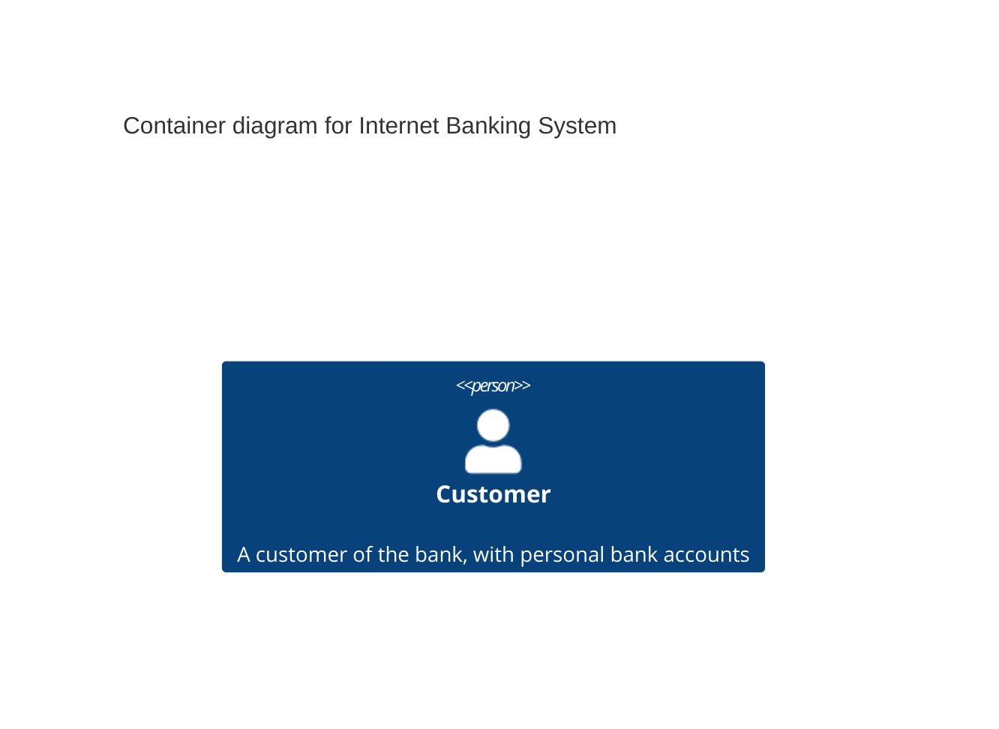

# Maintenance

This section is a kata that is aimed at highlighting problems with both application and test code that leads to
maintenance issues.

> Note: The code in this repository is example code and should not be used as a reference of production as is.

Below it the C4 Context diagram showing the pieces of the system that are relevant to this kata.

## Context

We have an existing cart implementation which handles adding and removing items, as well as total calculations that take
into account discounts and country takes.

## Kata

